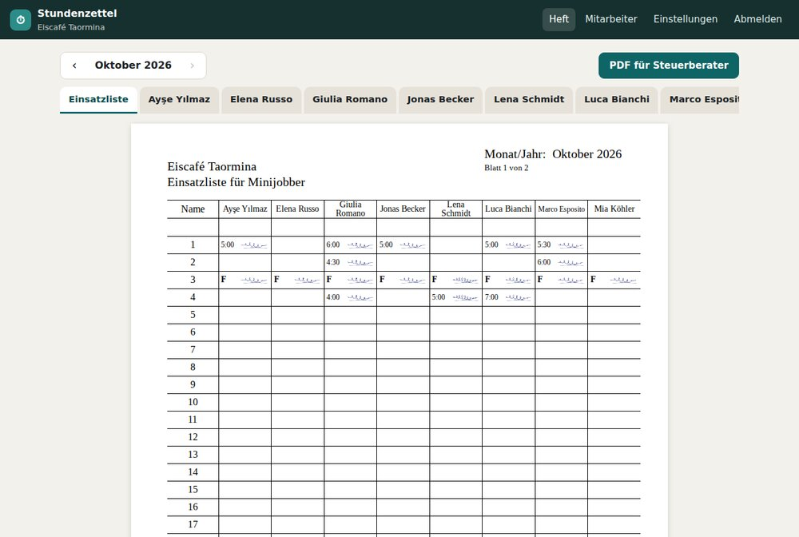
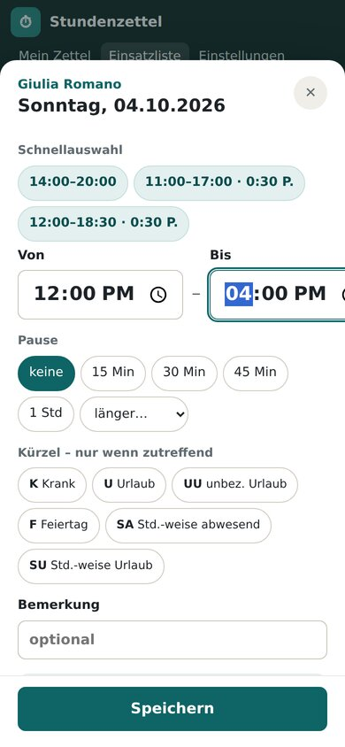
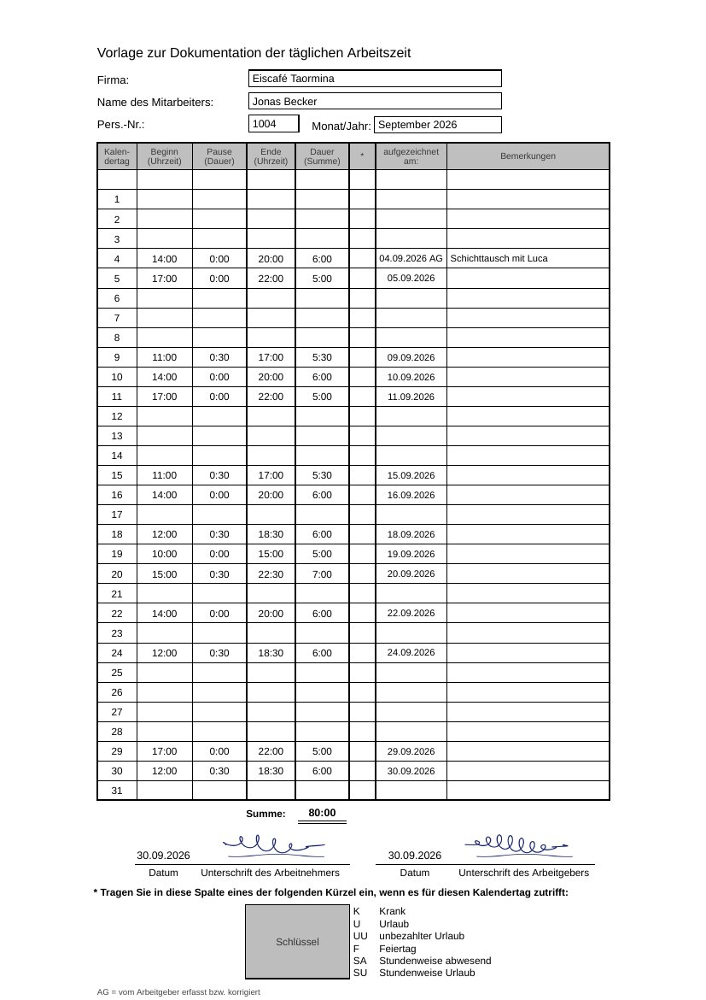

# Digitale Stundenzettel

Das Papier-Heft mit den Stundenzetteln – digital. Man schreibt **direkt ins Formular**, wie auf Papier,
nur ohne Rechnen und ohne ständiges Unterschreiben:

- **Mitarbeiter** tippen in ihrem Stundenzettel (*„Vorlage zur Dokumentation der täglichen
  Arbeitszeit“*) auf einen Tag. Im Eingabefenster wählen sie Beginn und Ende mit großen Knöpfen
  (erst Stunde, dann Minuten), optional Pause und Kürzel, und tippen auf **Speichern**. Dauer,
  Monatssumme, „aufgezeichnet am“ und die **Unterschrift** setzt das System.
- In der **Einsatzliste** (großes Blatt mit allen Mitarbeitern) geht es genauso: Zelle antippen,
  Zeiten wählen, speichern – die Zeile **Summe** rechnet mit.
- **Der Chef** blättert durch das Heft (Einsatzliste, dann jeder Mitarbeiter), unterschreibt nur einmal
  und lädt mit **einem Knopf** alles als PDF für den Steuerberater herunter.

| Chef: das Heft mit Registern | Mitarbeiter: direkt ins Formular tippen |
|---|---|
|  |  |

| PDF: Stundenzettel | PDF: Einsatzliste |
|---|---|
|  |  |

## So schreibt man ins Heft

1. Auf einen Tag tippen (im Stundenzettel die Zeile, in der Einsatzliste die Zelle).
2. Beginn wählen: erst die Stunde, dann die Minuten (:00, :15, :30, :45). Danach geht es von selbst
   mit dem Ende weiter.
3. Auf Speichern tippen. Das Fenster schließt sich, der Tag leuchtet kurz grün auf und unten steht,
   wie viele Stunden es waren.

Stunden stehen überall als Dezimalzahl mit Komma, zum Beispiel 4,50 h für 4 Std. 30 Min. In der
Einsatzliste steht pro Tag nur die Unterschrift, die Stunden zählt die Zeile Summe. „Aufgezeichnet am“
ist der Kalendertag des Eintrags, neben den Unterschriften steht der letzte Tag des Monats. Mehr als
16 Stunden an einem Tag lehnt die App als Tippfehler ab. Pause, Kürzel und Bemerkung werden nicht
mehr erfasst. Ein Eintrag lässt sich im Fenster über Löschen entfernen.

Mitarbeiter schreiben in ihren eigenen Zettel und ihre eigene Spalte der Einsatzliste (laufender und
Vormonat). Der Chef kann überall eintragen; seine Einträge werden mit **„AG“** gekennzeichnet.

## Unterschriften – einmal hinterlegen, nie wieder unterschreiben

| Stelle | Unterschrift | Datum |
|---|---|---|
| Stundenzettel, „Unterschrift des Arbeitnehmers“ | Mitarbeiter | letzter Tag des Monats |
| Stundenzettel, „Unterschrift des Arbeitgebers“ | Chef | letzter Tag des Monats |
| Einsatzliste, jede Tageszelle | Mitarbeiter (neben den Stunden) | – |
| Einsatzliste, unten | Chef | letzter Tag des Monats |

Mitarbeiter sehen in der Einsatzliste die Stunden der Kollegen (wie auf dem Papier), statt fremder
Unterschriften aber nur ein ✓. Der Chef und das PDF zeigen alle Unterschriften.
Die Unterschrift ist eine einfache elektronische Signatur; der Steuerberater akzeptiert sie.

## Einrichtung (einmalig)

1. App öffnen → **Ersteinrichtung**: Name des Betriebs und der erste Zugang. Wer das macht, wird
   **Inhaber** (Betreiber der App).
2. Unter **Inhaber** die Chef-Zugänge anlegen (Name, Benutzername, Startpasswort).
3. Jeder Chef meldet sich an, vergibt ein eigenes Passwort und unterschreibt dabei einmal als
   Arbeitgeber (geht auch später unter **Einstellungen**).
4. Unter **Mitarbeiter** jeden mit Name, Benutzername und Startpasswort anlegen.
5. Mitarbeiter melden sich an, vergeben ein eigenes Passwort und unterschreiben einmal – fertig.
   Tipp: im Handy-Browser „Zum Startbildschirm hinzufügen“, dann ist das Heft wie eine App da.

## Rollen

| | Mitarbeiter | Chef | Inhaber |
|---|---|---|---|
| Eigenen Stundenzettel / eigene Spalte der Einsatzliste beschreiben | ✓ | – | – |
| Alles sehen, überall eintragen (als „AG“), PDF für den Steuerberater | – | ✓ | ✓ |
| Mitarbeiter anlegen, bearbeiten, deaktivieren | – | ✓ | ✓ |
| Chef-Zugänge anlegen/entfernen, Rollen verteilen, Passwörter zurücksetzen | – | – | ✓ |

Der Bereich **Inhaber** erscheint nur bei Inhabern; alle anderen bekommen dort „Seite nicht gefunden“.
Weitere Inhaber kann ein Inhaber ernennen. Damit sich niemand aussperrt, bleiben immer mindestens ein
aktiver Inhaber und ein aktiver Chef bestehen. Wer schon Einträge oder Unterschriften im Heft hat, wird
beim Entfernen nur deaktiviert (Aufbewahrungspflicht). Wer selbst auch Stunden schreibt, legt sich
dafür zusätzlich einen normalen Mitarbeiter-Zugang an.

## Hell / Dunkel

Die App folgt automatisch der Einstellung des Handys bzw. Computers. Mit ☾/☀ oben in der Leiste
(oder unter **Einstellungen → Darstellung**) lässt sich das pro Gerät umstellen. Die Formulare selbst
bleiben immer weiß wie auf Papier.

## Online stellen mit Vercel (geht komplett vom Handy)

1. [vercel.com](https://vercel.com) öffnen → **mit GitHub anmelden**.
2. **Add New… → Project** → beim Repository **Digitale-Stunden-Zettel** auf **Import** → **Deploy**.
3. Die Seite zeigt „Noch eine Datenbank verbinden“: im Vercel-Projekt **Storage → Create Database → Turso**
   wählen (kostenloser Tarif) und mit dem Projekt **verbinden**.
4. **Deployments → oberster Eintrag → ⋯ → Redeploy** – danach Seite öffnen und einrichten.

Falls Turso unter Storage nicht angeboten wird: auf [turso.tech](https://turso.tech) (Anmeldung mit GitHub)
eine Datenbank anlegen und unter *Vercel → Settings → Environment Variables* `TURSO_DATABASE_URL` und
`TURSO_AUTH_TOKEN` eintragen, dann Redeploy. Jede Änderung im Repository geht automatisch online.

**Wichtig – feste Datenbank:** Die Turso-Anbindung von Vercel kann für jedes Deployment eine eigene,
leere Kopie anlegen (Servername beginnt mit `dpl-…`). Dann sind die Daten nach jedem Update weg; die App
warnt in diesem Fall rot. Abhilfe: unter *Settings → Environment Variables* die Variable
`TURSO_DATABASE_URL` mit der Adresse der festen Datenbank anlegen
(`libsql://<datenbankname>-<organisation>.<region>.turso.io`, z. B. aus dem Turso-Dashboard) und neu
deployen. Sie hat Vorrang vor den automatisch angelegten `STORAGE_…`-Variablen. Falls der vorhandene
Schlüssel nicht passt, zusätzlich `TURSO_AUTH_TOKEN` (im Turso-Dashboard „Create Token“) eintragen.

**Immer die feste Adresse verwenden** (im Vercel-Projekt unter *Domains*, z. B.
`digitale-stunden-zettel.vercel.app`). Vercel gibt jedem Update zusätzlich eine eigene Adresse mit
Zufallscode; dort kennt der Browser die Anmeldung nicht. Die App leitet solche Adressen deshalb
automatisch auf die feste Adresse um. Die Daten selbst liegen in der Datenbank und bleiben bei Updates
erhalten – unter **Inhaber → System** steht, welche Datenbank verwendet wird und wie viele Einträge
gespeichert sind.

### Brauchen wir eine Datenbank?

Ja – damit alle Zettel dauerhaft und für alle gemeinsam gespeichert sind. Verwendet wird SQLite (über libSQL):
online über [Turso](https://turso.tech), auf einem eigenen Server oder lokal als einzelne Datei
(`data/stundenzettel.db`).

### Alternative: eigener Server mit Docker

```bash
DOMAIN=stunden.eiscafe-beispiel.de docker compose up -d
```

Die Domain muss auf den Server zeigen; [Caddy](https://caddyserver.com) richtet HTTPS automatisch ein.

## Lokal starten

Voraussetzung: [Node.js](https://nodejs.org) ab Version 20.

```bash
npm install
npm start            # http://localhost:3000
npm test             # Tests
npm run demo         # nur für Entwicklung: Beispiel-Café in eine leere Datenbank (chef/chef1234, giulia/test1234)
```

| Variable | Standard | Bedeutung |
|---|---|---|
| `TURSO_DATABASE_URL` | – | Online-Datenbank (Turso/libSQL). Ohne Angabe wird die lokale Datei genutzt |
| `TURSO_AUTH_TOKEN` | – | Zugangsschlüssel für Turso |
| `DATA_DIR` | `data` | Ordner der lokalen Datenbank |
| `PORT` | `3000` | Port |
| `APP_TIMEZONE` | `Europe/Berlin` | Zeitzone für „heute“ und „aufgezeichnet am“ |
| `TRUST_PROXY` | auf Vercel automatisch | Hinter einem HTTPS-Proxy auf `1` setzen |

## Datensicherung

Unter **Einstellungen** (Chef) → „Sicherung herunterladen“: eine SQL-Datei mit allen Daten. Am besten
jeden Monat zusammen mit dem PDF ablegen. Arbeitszeitnachweise mindestens **2 Jahre** aufbewahren
(§ 17 MiLoG) – ausgeschiedene Mitarbeiter deshalb nur deaktivieren, nicht löschen.

## Technik

Node.js + Express, Seiten mit EJS, SQLite über libSQL, PDFs mit PDFKit (eingebettete Schrift *Liberation*,
SIL OFL). Beide Formulare haben ihre Maße zentral in [`src/layout.js`](src/layout.js) – Bildschirm und PDF
sehen dadurch gleich aus.

```
server.js, api/index.js   Start (lokal / Vercel)
src/routes/heft.js        Das Heft: Formulare anzeigen, Einträge speichern, PDF
src/routes/…              Anmeldung, Einstellungen, Mitarbeiter, Inhaber-Bereich
src/entries.js            Regeln beim Speichern (Rechte, automatische Unterschrift)
src/sheets.js, pdf.js     Formulardaten und PDF-Erzeugung
src/db.js, store.js       Datenbank
views/, public/           Seiten, Stil, Browser-Skript (Eingabe direkt im Formular, Unterschriftenfeld)
test/                     Tests, inkl. Online-Datenbank über einen Protokoll-Nachbau
```
