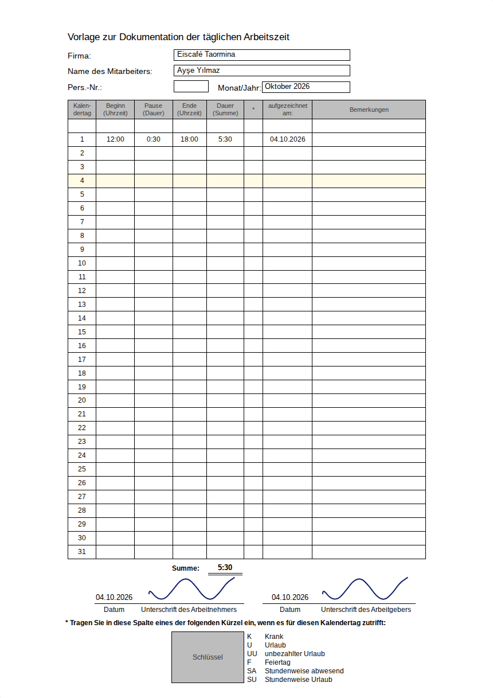

# Digitale Stundenzettel

Ein digitales Formularheft für ein Eiscafé: Stundenzettel und Einsatzliste werden direkt in den Tabellenzellen ausgefüllt. Die deutsche Oberfläche läuft ohne Build-Schritt im Browser, auch auf dem Handy.

Die beiden A4-Formulare folgen den bereitgestellten Papierfotos. Maße, Spalten, Leerzeilen, Summen und Unterschriftsfelder sind für Bildschirm und PDF zentral in [`src/layout.js`](src/layout.js) definiert. Auf dem Handy lässt sich das Blatt horizontal verschieben; die Eingabefelder bleiben in lesbarer Größe.

| Stundenzettel im Browser | Einsatzliste im Browser |
|---|---|
|  |  |

Die Bilder und die [Beispiel-PDF aus dem Abnahmetest](docs/abnahme.pdf) entstehen mit isolierten Testdaten. Im normalen Betrieb startet die Anwendung mit einer leeren Datenbank.

## Lokal starten

Voraussetzung: Node.js ab **22.13**, empfohlen Node.js 24.

```bash
npm ci
cp .env.example .env
npm start
```

Danach **http://localhost:3000** öffnen. Ohne Turso-Zugang wird `data/stundenzettel.db` verwendet. Es gibt keinen Build-Schritt.

1. Firmenname, Chef-Name, Benutzername und Passwort eingeben. Die Ersteinrichtung ist nur bei einer leeren Benutzertabelle erreichbar.
2. Die Unterschrift des Chefs einmal mit Finger oder Maus zeichnen.
3. Unter **Mitarbeiter** Name und Benutzername eingeben; ein Startpasswort wird vorgeschlagen.
4. Der Mitarbeiter meldet sich an, ersetzt sein Startpasswort und unterschreibt einmal. Danach öffnet sich direkt sein Stundenzettel.

## Eintragen wie im Heft

| Feld | Eingabe | Ergebnis |
|---|---|---|
| Beginn / Ende | `12`, `930`, `12.30` | 12:00, 09:30, 12:30 |
| Pause | `30`, `1`, `130`, leer | 0:30, 1:00, 1:30, keine Pause |
| Kürzel | `K`, `U`, `UU`, `F`, `SA`, `SU` | Auswahl gemäß Formularschlüssel |
| Einsatzliste | `12-16` | 4:00 Stunden, abzüglich bereits eingetragener Pause |
| Einsatzliste | `U`, `K` usw. | Ein Tag mit diesem Kürzel |
| Einsatzliste | Zelle leeren | Gesamten Tag löschen |

Der Stundenzettel speichert beim Verlassen der **Zeile** oder mit Enter, die Einsatzliste beim Verlassen der **Zelle** oder mit Enter. Beide Formulare bearbeiten denselben Datensatz pro Mitarbeiter und Tag. Im Stundenzettel löscht eine vollständig geleerte Zeile den Tag.

Dauer, Monatssumme und Unterschriften aktualisieren sich nach erfolgreichem Speichern. Unten erscheint kurz `✓ Gespeichert · Monatssumme 23:30 Std.`. Unvollständige oder ungültige Eingaben bleiben sichtbar markiert und verändern keine gespeicherten Daten. Auch beim Wechsel eines Registers wartet das Heft auf ausstehende Speicherungen.

Eine Schicht mit Ende vor Beginn läuft über Mitternacht. Die Pause bleibt erhalten, wenn in der Einsatzliste eine neue Zeitspanne eingetragen wird.

## Rollen und Unterschriften

- **Chef:** alle Mitarbeiter und Monate bearbeiten, Mitarbeiter anlegen oder deaktivieren, Einstellungen ändern, PDF und Datensicherung herunterladen. Eintragungen für Mitarbeiter erscheinen als **AG**, ohne deren Unterschrift.
- **Mitarbeiter:** eigener Stundenzettel und eigene Einsatzspalte; Änderungen nur im laufenden und im vorigen Monat. Stunden und Kürzel der Kollegen sind sichtbar, deren Unterschriften erscheinen als ✓.
- **Für alle:** keine zukünftigen Tage. Mitarbeiter können ohne hinterlegte Unterschrift nicht speichern. Deaktivierte Zugänge können sich nicht anmelden; ihre Einträge bleiben erhalten.

Unterschriften werden als PNG versioniert gespeichert. Jeder neue Tageseintrag verweist auf die damals hinterlegte Mitarbeiter- und Arbeitgeberversion. Neuzeichnen oder eine spätere Zeitkorrektur ersetzt diese Versionen nicht. Ein vom Chef erfasster Tag erhält erst dann eine Mitarbeiter-Unterschrift, wenn der Mitarbeiter ihn selbst speichert.

| Stelle | Verwendete Version und Datum |
|---|---|
| Stundenzettel, Arbeitnehmer | Letzter selbst erfasster und unterschriebener Eintrag des Monats |
| Stundenzettel, Arbeitgeber | Letzter Eintrag auf diesem Stundenzettel |
| Einsatzliste, Tageszelle | Mitarbeiter-Version dieses Eintrags; bei AG keine |
| Einsatzliste, Arbeitgeber | Letzter Eintrag aller aufgeführten Mitarbeiter |

„Letzter Eintrag“ bezieht sich auf den letzten **Speichervorgang**, einschließlich einer Korrektur. Das Datum unter der Unterschrift ist dessen Aufzeichnungsdatum. „Aufgezeichnet am“ verwendet die konfigurierte Zeitzone, standardmäßig Europe/Berlin.

Unter **Einstellungen** können alle ihre Unterschrift neu zeichnen und ihr Passwort ändern. Der Chef kann außerdem Firmenname, Titel der Einsatzliste und Logo ändern. Das Feld „Pers.-Nr.“ bleibt ausschließlich als leeres Druckfeld in der Vorlage bestehen.

## PDF für den Steuerberater

Ein Knopf erzeugt eine gemeinsame PDF:

1. Einsatzliste mit acht Mitarbeiterspalten pro Blatt, Monatssummen und Arbeitgeber-Unterschrift.
2. Ein Stundenzettel je Mitarbeiter mit Einträgen im gewählten Monat.

Die PDF enthält nur Mitarbeiter mit Einträgen. Ein vollständig leerer Monat liefert eine leere Einsatzliste. Alle Seiten sind A4 hoch; Linien und Text sind Vektoren, Unterschriften und Logo eingebettete Bilder. Liberation Sans und Liberation Serif werden eingebettet, auch für Namen wie **Ayşe Yılmaz**. Die Einsatzliste verwendet die Serifenschrift entsprechend der Times-Vorlage.

## Vercel mit Turso

1. Eine Turso-Datenbank und einen Zugriffstoken anlegen.
2. Das GitHub-Repository als Vercel-Projekt importieren. Ein Build-Befehl ist nicht erforderlich; [`vercel.json`](vercel.json) leitet an die Express-Funktion in `api/index.js` weiter.
3. In den Vercel-Umgebungsvariablen `TURSO_DATABASE_URL` und `TURSO_AUTH_TOKEN` setzen; für Produktivbetrieb und Vorschau passende, getrennte Datenbanken verwenden.
4. Bereitstellen bzw. erneut bereitstellen und die Ersteinrichtung auf der neuen URL ausführen.

Schriftdateien, EJS-Vorlagen und Browserdateien werden mit der Funktion ausgeliefert. Die Tabellen werden beim ersten Zugriff angelegt. Ohne konfigurierte Online-Datenbank zeigt Vercel eine Einrichtungsseite; es wird dort keine flüchtige lokale Datenbank verwendet.

Referenzen: [Turso JavaScript SDK](https://docs.turso.tech/sdk/ts/reference), [Express auf Vercel](https://vercel.com/docs/frameworks/backend/express).

## Docker

Für einen eigenen Server mit einer auf ihn zeigenden Domain:

```bash
DOMAIN=stunden.example.de docker compose up -d --build
```

Caddy übernimmt HTTPS. Die lokale Datenbank liegt dauerhaft im Docker-Volume `stundenzettel-daten`.

| Variable | Standard | Bedeutung |
|---|---|---|
| `TURSO_DATABASE_URL` | leer | Turso/libSQL-Datenbank; ohne Angabe lokal |
| `TURSO_AUTH_TOKEN` | leer | Zugriffstoken, nur serverseitig |
| `DATA_DIR` | `data` | Ordner der lokalen Datenbank |
| `PORT` | `3000` | Lokaler Port |
| `APP_TIMEZONE` | `Europe/Berlin` | „Heute“ und Aufzeichnungsdatum |
| `TRUST_PROXY` | auf Vercel `1`, sonst aus | Bei genau einem vorgeschalteten HTTPS-Proxy `1` |
| `COOKIE_SECURE` | abhängig von HTTPS | `true` erzwingt Cookies ausschließlich über HTTPS |

## Sicherung und Aufbewahrung

**Einstellungen → Datensicherung herunterladen** erzeugt eine SQL-Datei mit Einstellungen, Benutzern, Passwort-Hashes, Unterschriftsversionen und Einträgen. Laufende Sitzungen und vorübergehende Anmeldesperren werden nicht exportiert. Die Datei vertraulich aufbewahren.

Wiederherstellung in eine **neue, leere** lokale Datenbank bei gestoppter Anwendung:

```bash
sqlite3 data/wiederhergestellt.db < Sicherung.sql
```

Danach `DB_FILE=data/wiederhergestellt.db` in `.env` setzen und die App starten. Für Turso lässt sich die SQL-Datei in eine leere Datenbank importieren. Die Wiederherstellung wird automatisch getestet.

Mitarbeiter werden deaktiviert, nicht gelöscht. Es gibt keine automatische Löschung von Einträgen oder Unterschriften; damit können die geforderten zwei Jahre Aufbewahrung eingehalten werden.

## Sicherheit und Tests

Passwörter: scrypt mit individuellem Salt. Sitzungen: zufällige Token, nur deren Hashes in der Datenbank, HttpOnly- und SameSite-Cookies. Alle schreibenden Requests, auch Login und Ersteinrichtung, benötigen ein CSRF-Token. Die Anwendung setzt eine Content-Security-Policy und prüft Bearbeitungsrechte auf dem Server. Nach fünf falschen Anmeldungen greift eine fünfminütige Sperre, persistent über Serverinstanzen hinweg.

```bash
npm test
npx playwright install chromium
npm run test:browser
# oder beide Gruppen:
npm run test:all
```

Die Tests prüfen Zeitformate, Pausen und Mitternacht, Einsatzlisten-Eingaben, Rechte, Zukunftstage, Signaturversionen, AG-Einträge, Anmeldung, CSRF, parallele Ersteinrichtung, SQL-Wiederherstellung sowie die libSQL-HTTP-Anbindung mit einem Protokoll-Testserver. Der PDF-Test prüft A4, mehr als acht Mitarbeiter, Seitenzahl, eingebettete Schriften/Bilder und türkische Namen.

Playwright durchläuft die Einrichtung und Abnahme im Desktop-Browser sowie mit mobiler Chromium-Emulation: direkte Zeileneingabe, Autospeichern, Tabwechsel während des Speicherns, Fehler, Einsatzliste, Summen, Unterschriften, AG und PDF-Download. Ein echter Turso-Account und ein Vercel-Deployment sind nicht Bestandteil der lokalen Tests.

GitHub Actions führt beide Testgruppen bei Push und Pull Request aus.

## Aufbau

- `src/layout.js`: gemeinsame A4-Maße für Browser und PDF.
- `public/js/time-input.js`: gemeinsamer Parser für Browser und Server.
- `src/entries.js`: Tagesdaten, Berechtigungen und Signaturzuordnung.
- `src/sheets.js`, `src/pdf.js`: Formulardaten und PDFKit-Ausgabe.
- `src/db.js`, `src/store.js`: Migrationen und libSQL-Datenzugriff; atomare Schreibvorgänge.
- `src/auth.js`, `src/routes/`: Anmeldung, Heft, Mitarbeiter, Einstellungen.
- `views/`, `public/`: serverseitiges EJS, CSS und Vanilla-JavaScript.
- `assets/fonts/`: mitgelieferte Liberation-Schriften samt Lizenz.

Bestehende Datenbanken werden ohne Datenverlust migriert. Eventuell vorhandene historische Zusatztabellen werden nicht gelöscht, aber nicht verwendet. Neue Datenbanken enthalten die fünf Anwendungstabellen `settings`, `users`, `signatures`, `entries`, `sessions` und die technische Migrationstabelle `schema_version`.
